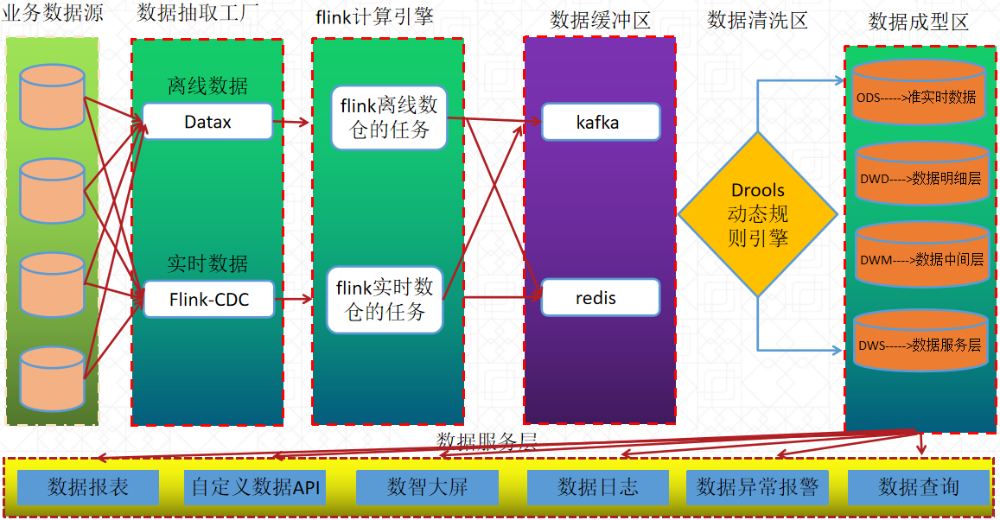

# RuoShui-BigData

#### 介绍

####内置功能
用户管理：用户是系统操作者，该功能主要完成系统用户配置。
部门管理：配置系统组织机构（公司、部门、小组），树结构展现支持数据权限。
岗位管理：配置系统用户所属担任职务。
菜单管理：配置系统菜单，操作权限，按钮权限标识等。
角色管理：角色菜单权限分配、设置角色按机构进行数据范围权限划分。
字典管理：对系统中经常使用的一些较为固定的数据进行维护。
参数管理：对系统动态配置常用参数。
通知公告：系统通知公告信息发布维护。
操作日志：系统正常操作日志记录和查询；系统异常信息日志记录和查询。
登录日志：系统登录日志记录查询包含登录异常。
在线用户：当前系统中活跃用户状态监控。
定时任务：在线（添加、修改、删除)任务调度包含执行结果日志。
代码生成：前后端代码的生成（java、html、xml、sql）支持CRUD下载 。
系统接口：根据业务代码自动生成相关的api接口文档。
服务监控：监视当前系统CPU、内存、磁盘、堆栈等相关信息。
缓存监控：对系统的缓存查询，删除、清空等操作。
在线构建器：拖动表单元素生成相应的HTML代码。
连接池监视：监视当前系统数据库连接池状态，可进行分析SQL找出系统性能瓶颈。
#### 软件架构

######软件包含下面几个功能模块
1.数据集成（集成Datax-Web 所有功能 开源地址：https://gitee.com/WeiYe-Jing/datax-web）
2.数据开发（集成flink-streaming-platform-web所有功能  开源地址：https://gitee.com/zhuhuipei/flink-streaming-platform-web）
3.数据资产（集成datax-cloud部分功能 开源地址：https://gitee.com/yuwei1203/datax-cloud）
4.数据标准
5.数据质量
6.数据API
（后续会继续优化现有功能，开发商业业务功能）
#### 系统截图

1.  xxxx
2.  xxxx
3.  xxxx

#### 使用说明

1.  xxxx
2.  xxxx
3.  xxxx

#### 参与贡献

1.  Fork 本仓库
2.  新建 Feat_xxx 分支
3.  提交代码
4.  新建 Pull Request

#### 特技

1.  使用 Readme\_XXX.md 来支持不同的语言，例如 Readme\_en.md, Readme\_zh.md
2.  Gitee 官方博客 [blog.gitee.com](https://blog.gitee.com)
3.  你可以 [https://gitee.com/explore](https://gitee.com/explore) 这个地址来了解 Gitee 上的优秀开源项目
4.  [GVP](https://gitee.com/gvp) 全称是 Gitee 最有价值开源项目，是综合评定出的优秀开源项目
5.  Gitee 官方提供的使用手册 [https://gitee.com/help](https://gitee.com/help)
6.  Gitee 封面人物是一档用来展示 Gitee 会员风采的栏目 [https://gitee.com/gitee-stars/](https://gitee.com/gitee-stars/)
